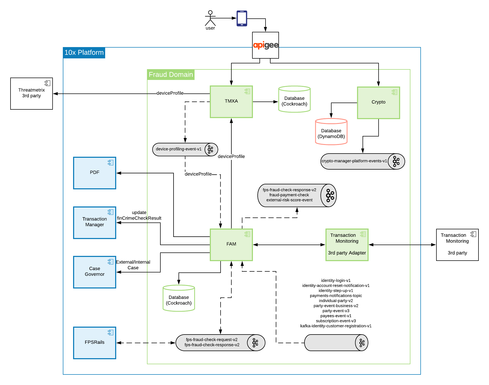
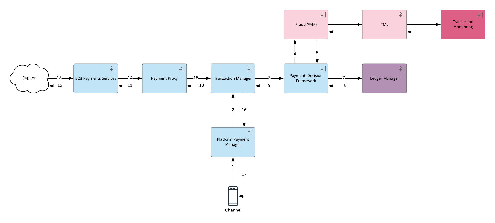
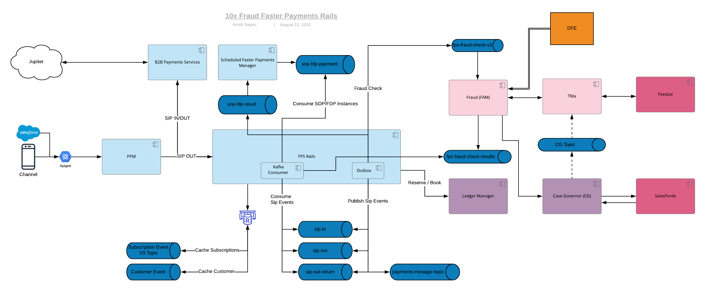
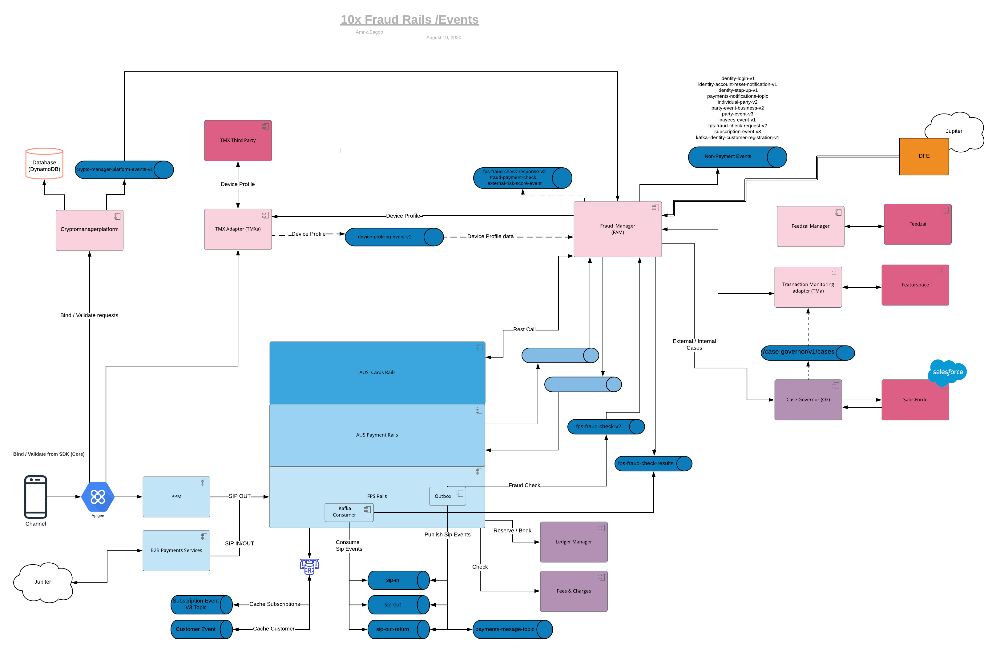
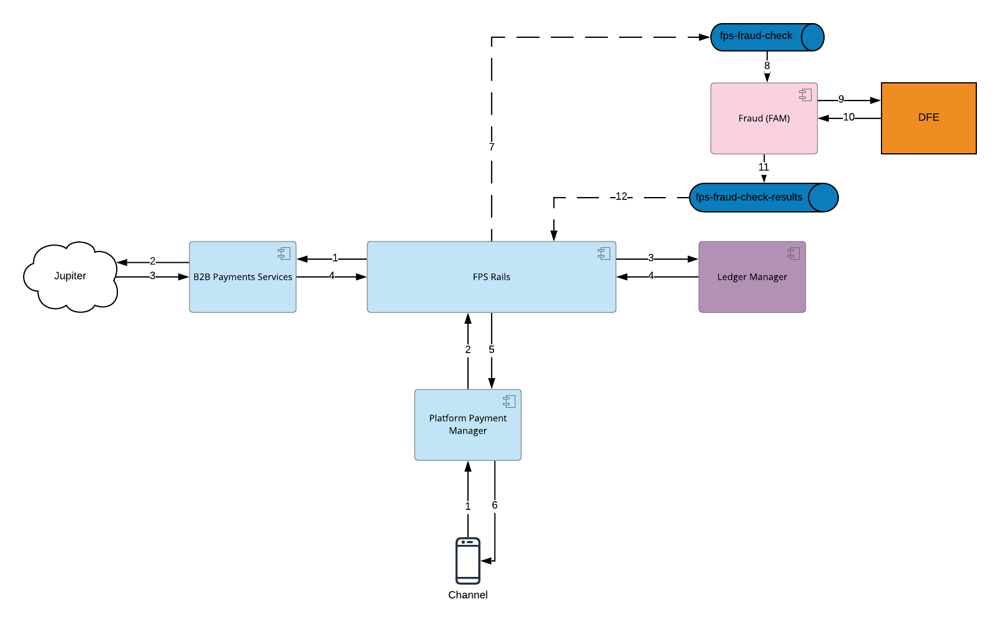
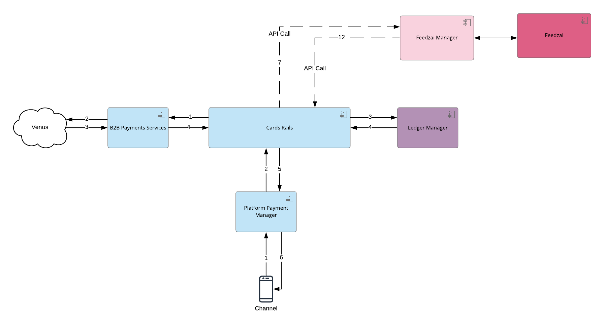
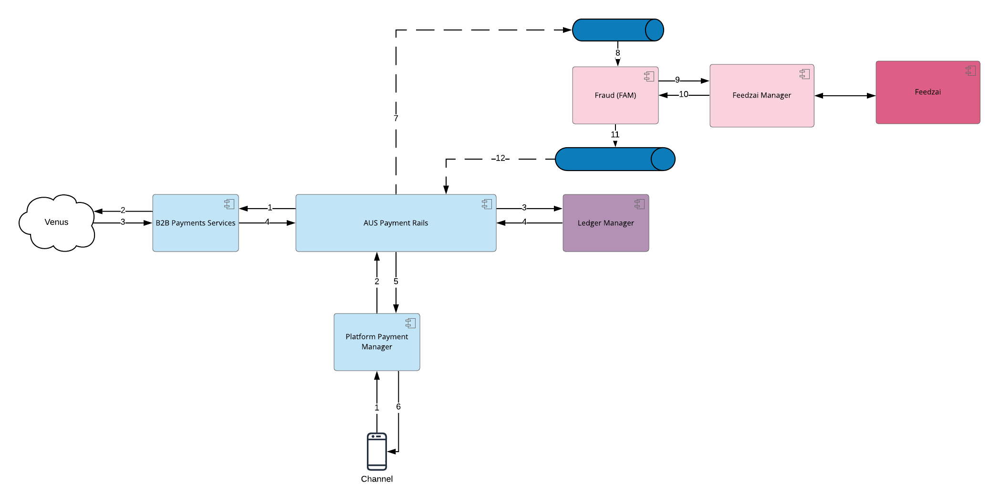
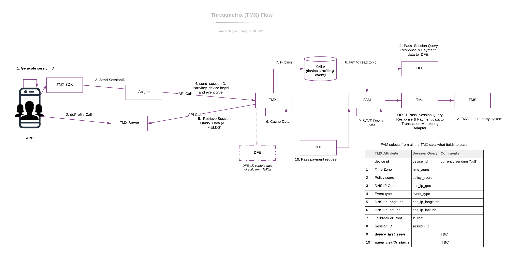

= On Call Runbook - 3.3
:toc:
:toclevels: 4

== Helper tools
---
[cols="2"]
|===
|Environments
a|
* devblue

* solution-testblue
|Grafana
| Url (DevBlue): https://grafana.devblue.mylti3gh7p4x.net/d/mL5cgomGz/ft24-kafka?orgId=1&refresh=10s&var-app_label=fraudamlmanager&var-namespace_label=fraud
choose the App dashboard from the dropdown list on the top left.

Url (STB): https://grafana.solution-testblue.mylti3gh7p4x.net/d/mo5hRTmMz/f24-fraud-aml-manager?orgId=1&refresh=5s

Only FAM available at the moment in STB

| Kubernetes
| Please refer to this document, https://confluence.10x.mylti3gh7p4x.net/display/TECH/Testing+Standards[Section 4: Testing Standards to access]

k8s: https://confluence.10x.mylti3gh7p4x.net/display/TECH/How+to+access+Kubernetes+as+a+developer[How to access Kubernetes as a developer]

| Logs
| Please refer to this document, https://confluence.10x.mylti3gh7p4x.net/display/TECH/Testing+Standards[Section 4.2: Testing Standards]
After setup **`kubectl`**, follow commands below in terminal

1. Get pod with **``kubectl get pods``**,
and then we see a list of pods, grab the required microservice pod name.

2. Get log by pod name **``kubectl logs [pod name]``**

| Cockroach DB
| Please refer this article https://confluence.10x.mylti3gh7p4x.net/display/TECH/CockroachDB+access+to+microservice[CockroachDB access to microservice]
| Kafka UI
|
Useful for looking at existence of messages on a topic
https://kafkaui-analytics.svc.devblue.mylti3gh7p4x.net/[https://kafkaui-analytics.svc.{ENVIRONMENT}.mylti3gh7p4x.net/]
|Health of the service
| FAM:
curl https://fraudamlmanager-fraud.svc.solution-testblue.mylti3gh7p4x.net/health

| Query Prometheus
|https://prometheus.{ENVIRONMENT}.mylti3gh7p4x.net/targets

| CloudWatch Logs
| To access the logs in CloudWatch:
https://confluence.10x.mylti3gh7p4x.net/display/TECH/Searching+and+Matching+Terms+in+AWS+CloudWatch+Logs+-+10x+L1SD+Runbook

On step #8 search for "fraud-fraudamlmanager".

|===
---
=== Runbooks of Dependent Services

General diagram for interconnectivity of services (click to zoom).



For more information on the payment data flow check the following https://confluence.10x.mylti3gh7p4x.net/pages/viewpage.action?spaceKey=TECH&title=FAM+V1%2C+V2+%2C+V3+APIs[diagram].

---
[cols="2"]
|===

| https://confluence.10x.mylti3gh7p4x.net/display/SM/Payment+Decision+Framework+-+On+Call+Runbook+-+3.0[Payment Decision Framework (PDF)]

a| Kafka events to request and response fraud check out come.

* Fraud process into PDF: +


|https://confluence.10x.mylti3gh7p4x.net/display/SM/FPS+Rails+-+On+Call+Runbook[FPSRail (payment)]
a| As above. Check the following diagram for more information:

* Fraud to FPS rails: +



* Fraud to FPS Rails-Fraud E2E: +



* Fraud to FPS Rails-Jupiter Fraud FPS Rails: +



* Fraud_to_FPS_Rails-Venus_Card_Rails: +



* Fraud to FPS Rails-Venus Payment Rails: +




| https://confluence.10x.mylti3gh7p4x.net/display/SM/Threatmetrix+Adapter+-+Runbooks[Threat Metrix Adapter]
a| Sibling service called by FAM during operations Risk Score operation.

* Check the following diagram for more information: +



| *Transaction Monitoring System*

https://confluence.10x.mylti3gh7p4x.net/display/SM/Transaction+Monitoring+Adapter+-+Runbooks[Transaction Monitoring Adapter]
or
DFE (Dynamo Fraud Engine)
| Downstream service which is called by FAM during a finCrimeCheck operation.

In Jupiter, FAM calls DFE instead of TMA, this is in Jupiter E2E only.

| https://confluence.10x.mylti3gh7p4x.net/display/SM/Transaction+Manager+-+Runbooks[Transaction Manager]
|Downstream service called by FAM after finCrimeCheck result is received, to process the payment transaction.
|https://confluence.10x.mylti3gh7p4x.net/display/SM/Case+Governor+-+Runbooks[Case Governor]
|Downstream service called by FAM after finCrimeCheck result is received, to create case depends on fin crime check result status.

|===

---
== Troubleshooting

To check CloudWatch logs please follow <<Helper tools>>.

If none of the issues listed bellow help solving the problem, you can contact
https://confluence.10x.mylti3gh7p4x.net/display/SM/Fraud+AML+Manager+-+Feature+Team+24[Feature Team 24].

=== Microservice

==== Transaction Monitoring System
---
===== Issues with Bad Request
---
[cols="2"]
|===
| Observer
| FAM request Transaction Monitoring System for fraud outcome

| Description
| The call fails with **400** Bad Request error message for _direct, domestic_ or _onus_ payment

FAM request returns error message.

| Console log
a| `#org.springframework.http.converter.HttpMessageNotReadableException: JSON parse error`
`
| Possible causes
|The request payload is malformed.

| Response sample
a|
```{
"timestamp": "2020-07-01T14:07:39.642+0000",
"status": 400,
"error": "Bad Request",
"message": "JSON parse error"
}
```

| CloudWatch log sample
a|
```{
{"log":"\u001b[30m2020-08-24 14:09:58,207\u001b[0;39m
\u001b[31mWARN \u001b[0;39m [\u001b[34mhttp-nio-8080-exec-7\u001b[0;39m]
\u001b[33morg.springframework.web.servlet.handler.AbstractHandlerExceptionResolver\u001b[0;39m:
Resolved [org.springframework.http.converter.HttpMessageNotReadableException:
JSON parse error:
Unexpected character (',' (code 44)): expected a value; nested exception is com.fasterxml.jackson.core.JsonParseException:
Unexpected character (',' (code 44)): expected a value\n",
}
```

|Actions
|Check the console log to find the reason for JSON deserialization failure.
To get logs, see the *log* section in <<Helper tools>>


|===

---

[cols="2"]
|===
| Observer
| FAM request Transaction Monitoring System for fraud outcome

| Description
| The call fails with 400 Bad Request error message for _direct, domestic_ or _onus_ payment

| Console log
a| `org.springframework.web.bind.MethodArgumentNotValidException`

| Possible causes
| The request payload is probably missing a field.

| Response sample
a|
```
{
"timestamp": "2020-07-01T14:07:39.642+0000",
"status": 400,
"error": "Bad Request",
"errors": [{}],
"message": "Validation failed for object='PaymentObject'. Error count: 1",
}
```

| CloudWatch log sample
a|
```{
{"log":"\u001b[30m2020-08-24 14:12:26,078\u001b[0;39m
\u001b[31mWARN \u001b[0;39m [\u001b[34mhttp-nio-8080-exec-3\u001b[0;39m]
\u001b[33morg.springframework.web.servlet.handler.AbstractHandlerExceptionResolver\u001b[0;39m:
Resolved [org.springframework.web.bind.MethodArgumentNotValidException:
Validation failed for argument [0] in public com.tenx.fraudamlmanager.payments.model.api.FraudCheckResponse
com.tenx.fraudamlmanager.payments.controller.v1.DirectCreditPaymentsController.checkDirectCredit(com.tenx.fraudamlmanager.payments.model.api.DirectCreditPayment)
throws com.tenx.fraudamlmanager.payments.client.exceptions.TransactionMonitoringException:
[Field error in object 'directCreditPayment'
}
```

|Actions
|Verify the integrity of the request payload.
|===

---

===== Issues with Internal Server Error
---
[cols="2"]
|===
|Observer
| FAM calls DFE for fraud outcome (To be Updated after this JIRA ticket is resolved: https://jira.10x.mylti3gh7p4x.net/browse/DEV-110098[Improve Exception handling to external services])

| Description
| The call fails with *500* Bad Request error message for _direct, domestic_ or _onus_ payment.

| Possible causes
a|
1. Transaction Manager responses internal error

2. If Console log:
`“nested exception is feign.RetryableException”`, then the request is timed out.

| Response sample
a|
```
{
"timestamp": ,
"status": 500,
"error": "Internal Server Error",
"message": "Some Error Message",
"path": "{}"
}
```

| Actions
| Check if outcome is received from the Transaction Monitoring System - check logs from Transaction Monitoring System.

 Check health of Transaction Monitoring System. See <<Runbooks of Dependent Services>>.

|===
---
==== Transaction Manager

===== Internal Server Error
---
[cols="2"]
|===
| Observer
| FAM calls finCrimeCheckResult endpoint

| Description
| The request failed with **500** internal server error

Transaction Manager doesn’t get the payment fraud check result
_/v2/payments/finCrimeCheckResult_ returns http status *500* with response

|Possible Causes
a| 1. Transaction is not ready to be updated in Transaction Manager

2. Transaction Manager is down

3. Transaction Manager is busy and causes request timeout

| Response sample
a|
```
{
"httpStatusCode": 500,
"message": "Failed to notify Transaction Manager."
}
```

| CloudWatch log sample
a|
```{
{"log":"\u001b[30m2020-08-19 03:12:15,175\u001b[0;39m
\u001b[1;31mERROR\u001b[0;39m [\u001b[34mhttp-nio-8080-exec-10\u001b[0;39m]
\u001b[33mcom.tenx.fraudamlmanager.FraudAMLControllerAdvice\u001b[0;39m:
Class: class com.tenx.fraudamlmanager.payments.fincrimecheckresult.domain.FinCrimeCheckResultException-
Message: Failed to notify Transaction Manager.-
cause: com.tenx.fraudamlmanager.infrastructure.transactionmonitoring.exceptions.TransactionManagerException: Transaction Manager client error
}
```

|Actions
| 1. Check Transaction Manager Database, if status is pending then it is a FAM issue, else Check the availability and health of Transaction Manager. See TM in <<   Runbooks of Dependent Services>>

2. If it is the FAM issue then check FAM log. See logs in <<Helper tools>>

3. FAM only retries Transaction Manager with error Internal Server Error with *2319* error code. If FAM didn't retry then raise with Transaction Manager

|===
---
==== Case Creation

===== Failed creating cases
---
[cols="2"]
|===
|Observer
|FAM calls  `finCrimeCheckResult` endpoint

|Description
|The request *succeed* but FAM logs error with creating case in Case Governor

|Symptoms
a|Payment Case is not found

Log: `Failed retrieve case reference. transactionId: {}`

Case Governor returns error
Log: `Failed request case governor. transactionId: {}`


| CloudWatch log sample
a|
```{
{"log": "\u001b[30m2020-08-17 17:35:02,533\u001b[0;39m \u001b[1;31mERROR\u001b[0;39m [\u001b[34mhttp-nio-8080-exec-5\u001b[0;39m]
\u001b[33mcom.tenx.fraudamlmanager.cases.domain.internal.InternalCasesService\u001b[0;39m:
Failed request case governor. transactionId: Internal Case Created Governor Request Failed. \n",}
```


|Possible causes
| 1. Payment case is not created during fin crime check

2. Case Governor is down

3. Missing required fields in the payload that is sent to Case Governor

|Actions
| Check if the payment is saved in the database. See CockroachDB access in <<Helper tools>>

If there is data in the record in database, then check if data is correctly formed.

 Check the health of https://confluence.10x.mylti3gh7p4x.net/display/SM/Case+Governor+-+Runbooks[Case Governor]
|===

---

[cols="2"]
|===

|Observer
|FAM calls  _finCrimeCheckResult_ endpoint

|Description
|The request *succeed* but FAM logs error with creating case in Case Governor - Failed to save Transaction Case in table transaction_case after Case is created in Case Governor

|Symptoms
|Log: `Storing case creation for payment failed, transactionId : {}`

|Possible causes | 1. Case Id is not found in the case creation response

2. Database connection |Actions |Check the health of Cockroach DB, for more information refer the Cockroach section of <<Helper tools>>

|===

---

[cols="2"]
|===

|Observer
|FAM calls `finCrimeCheckResult` endpoint [To Be Updated After Fixing https://jira.10x.mylti3gh7p4x.net/browse/DEV-200905[PaymentType issues for FPSRails]]

|Description
| Call Failed to delete Payment Case in table payment_case when fin crime check result status is PASSED, BLOCKED, CANCELLED, REJECTED and external case is empty in the request

| Symptoms
| Log: `FinCrime Check Result case deletion failed for transaction ID: {}`

|Possible causes
| 1. Payment case is not created during fin crime check

2. Database connection |Actions |Check the health of Cockroach DB, for more information refer the Cockroach section of <<Helper tools>>

|===
---

=== Kafka

==== FPSRails in Payment
---
===== Issue with FPSRail Kafka event
---
[cols="2"]
|===
| Observer
| FAM listens to the FPSRail Kafka event

| Description
| FAM has no response - FAM failed acknowledge FPSRail request event

| Possible cause
| Issues with Kafka producer

Kafka event is posted event in a format FAM listener is working properly

Other issues with processing Kafka event, details see below

| Actions
|

Check if the FPSRail request event is posted on Kafka(see** Kafka UI** in <<Helper tools>> for existence of messages on a topic)

Check if the FPSRail response event is posted on Kafka, as above

Check if there is any relevant FAM log.
See <<Helper tools>> for log access.

|===
---
===== Issue with reading Kafka message
---
[cols="2"]
|===
| Observer
| FAM listens to the FPSRail Kafka event

| Description
| FAM has no response - FAM FPSRail listener failed to acknowledge the topic `fps-fraud-check-request-v2` throws nested exception with cause of Parse exception.

| Possible cause
| Parse exception is thrown when mapping message to internal object for `fraud inbound, outbound or outbound return` payment

Income Kafka message has incorrectly formatted or missing date

| Actions
| Check date format on inbound/outbound/outbound return message for above mentioned Kafka topic. (see** Kafka UI** in <<Helper tools>> for existence of messages on a topic)

  Check if the amount `value` and `baseValue` on inbound/outbound/outbound messages for above mentioned Kafka topic can be converted to double

  Correlate the exception with the latest Fraud inbound\outbound\outbound return payment kafka event received to identify the problematic transactionId.
|===
---
===== Issue with requesting Transaction Monitoring
---
[cols="2"]
|===

| Observer
| FAM listens to the FPSRail Kafka event.
| Description
| FAM has no response - FAM FPSRail listener failed to acknowledge the topic `fps-fraud-check-request-v2` throws nested exception with cause of Transaction Monitoring exception.
FAM has error response and console log is `Failed to call Transaction Monitoring Adapter for DomesticOutReturnPaymentV2 with ID: {some transaction Id}"`
nested exception type is : {}

| CloudWatch log sample
a|
```{
{"log":"\u001b[30m2020-08-19 13:56:38,428\u001b[0;39m \u001b[1;31mERROR\u001b[0;39m [\u001b[34mLoginAttemptsEventListener-0-C-1\u001b[0;39m]
\u001b[33mcom.tenx.fraudamlmanager.infrastructure.DeserialisationDlqErrorHandler\u001b[0;39m: Error in processing kafka message org.springframework.kafka.listener.ListenerExecutionFailedException:
Listener method 'public void com.tenx.fraudamlmanager.authentication.loginattempts.api.LoginAttemptsEventListener.handleLoginAttemptsEvent(org.apache.kafka.clients.consumer.ConsumerRecord<java.lang.String,
com.tenx.security.forgerockfacade.resource.Login>,org.springframework.kafka.support.Acknowledgment) throws com.tenx.fraudamlmanager.payments.client.exceptions.TransactionMonitoringException' threw exception;
nested exception is com.tenx.fraudamlmanager.payments.client.exceptions.TransactionMonitoringException:
{\"timestamp\":\"2020-08-19T13:56:38.350+0000\",\"status\":400,\"error\":\"Bad Request\",\"errors\":[
{\"codes\":[\"NotEmpty.loginAttemptsRequest.partyKey\",\"NotEmpty.partyKey\",\"NotEmpty.java.lang.String\",\"NotEmpty\"],\"arguments\":[{
\"codes\":[\"loginAttemptsRequest.partyKey\",\"partyKey\"],\"arguments\":null}
}
```

| Possible Cause

|Issue occurs when calling Transaction Monitoring endpoint
| Actions
|   Check FAM response, if it is **400** <<_issues_with_bad_request>> then check payload, there is probably a missing field in the payment request;

Check Transaction Monitoring system connection; https://confluence.10x.mylti3gh7p4x.net/display/SM/Transaction+Monitoring+Adapter+-+Runbooks[Transaction Monitoring Adapter Runbook]

Check other Transaction Monitoring system possible connection issues

|===

---
==== Issue with FPSRail in `finCrimeCheckResult`
---
[cols="2"]
|===

| Observer
| FAM is requesting `finCrimeCheckResult` endpoint
AND FPS_FINCRIME_CHECK_OUTCOME_TO is set to `FPSRail`

In this case, FAM posts the outcome to response FPSRail topic instead of calling Transaction Manager

| Description
|
FAM fails to post the response to Kafka AND the request fails with **500** internal server error

_AND_

FAM logs the error: `"Failed to notify FPS Rails, transactionId: {}"`

| Possible Cause
| Issues with retrieving payment type.

FAM producer doesn't post the response properly.

| Response sample
a|
```
{
"httpStatusCode": 500,
"message": "Failed to notify FPS Rails."
}
```

| CloudWatch log sample
a|
```{
{"log":"\u001b[30m2020-08-21 15:10:29,929\u001b[0;39m \u001b[1;31mERROR\u001b[0;39m [\u001b[34mhttp-nio-8080-exec-3\u001b[0;39m]
\u001b[33mcom.tenx.fraudamlmanager.paymentsv2.fincrimecheckresult.domain.FinCrimeCheckResultServiceImplV2\u001b[0;39m: Failed to notify FPS Rails,
transactionId: 34a66301-576e-4e04-a396-8bb0556c16dc \n","stream":"stdout","docker":
{"container_id":"bd10b0a89b68f5b990bed52a9393ded491e0209303af1b438336d0a30c60cd18"},"kubernetes":
{"container_name":"main","namespace_name":"fraud","pod_name":"fraudamlmanager-default-7bfbf6446-q2g52","pod_id":"fc25a331-eecd-4b6e-b02c-a264a734d4fb","labels":
{"10x/colour":"","app":"fraudamlmanager","pod-template-hash":"7bfbf6446","restarted-at":"1597170745.318218"},"host":"ip-10-19-43-59.eu-west-1.compute.internal","master_url":"https://172.20.0.1:443/api"},"pod_name":"fraudamlmanager-default-7bfbf6446-q2g52","namespace_name":"fraud","container_name":"main","app_name":"fraudamlmanager","stream_name":"fraud-fraudamlmanager"}
}
```

| Actions
| Check if event is FPSRail is posted to Kafka, see** Kafka UI** in <<Helper tools>> for existence of messages on a topic

Check JDBC connection and other relevant FAM log, See <<Helper tools>> for log access.

Check if the payment had deleted from the database, See <<Helper tools>> for cockroach DB.
|===
---
==== Payment Decision Framework (PDF)
---
[cols="2"]
|===
| Observer
| FAM received payment request for fraud check

| Description
| FAM has no response for PDF

| Possible cause
| Kafka event is not posted properly

 FAM fails reading Kafka event

Other issues with processing Kafka event, details see below

| Actions
| Check if there is any relevant FAM log,  See <<Helper tools>> for log access.

Check if the PDF response event is posted on Kafka, see** Kafka UI** in <<Helper tools>> for existence of messages on a topic
|===

== https://confluence.10x.mylti3gh7p4x.net/display/TECH/FAM+-+Payments+Config%3A+Golden+Source+of+Truth[Payments Config]

---
== Glossary

---

[cols="2"]
|===
| FAM
| Fraud AML Manager

| DFE
| Dynamo Fraud Engine

|FPS Rails
|Faster Payments Service Rails

|PDF
|Payment Decision Framework

|JDBC
|Java Database Connectivity

|CockroachDB
|It is a database - used for running dual databases in different regions. Stores copies of data in multiple locations in order to deliver speedy access.

|Grafana
|Open source metric analytics & visualization suite. It is most commonly used for visualizing time series data for infrastructure and application analytics.

|Kafka
|Open source stream processing platform. Used to build data pipelines and streaming apps that can process data in real time.

|Kafka topic (topic)
|All Kafka messages are organised into topics. A consumer pulls messages off of a Kafka topic while producers push messages into a Kafka topic.

|Kafka producer
|A Kafka client that publishes records to the Kafka cluster.

|kubectl
|Command line tool for controlling Kubernetes clusters.

|Kubernetes pod
|The smallest deployable unit of computing that can be created and managed in Kubernetes.

|Prometheus
|An open source monitoring system developed by engineers at SoundCloud. Runs on an EC2 instance collecting metrics from all the AWS services and stores them on S3 buckets to be pulled by Grafana for monitoring.
|===

